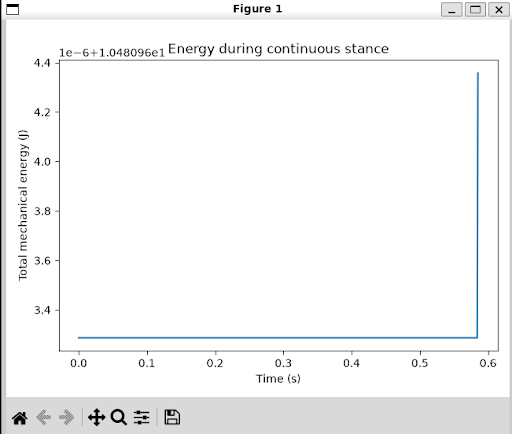
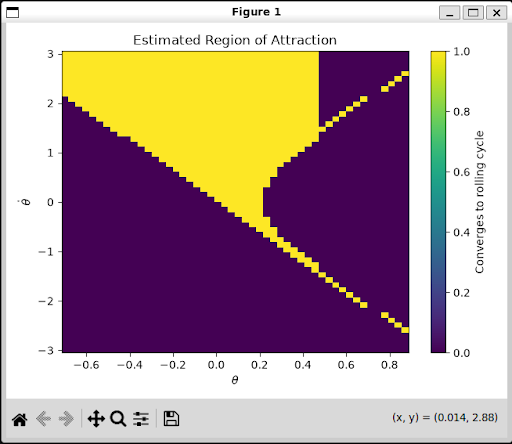
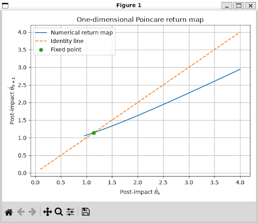
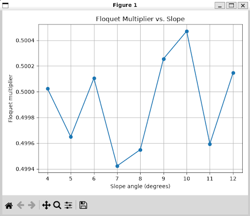
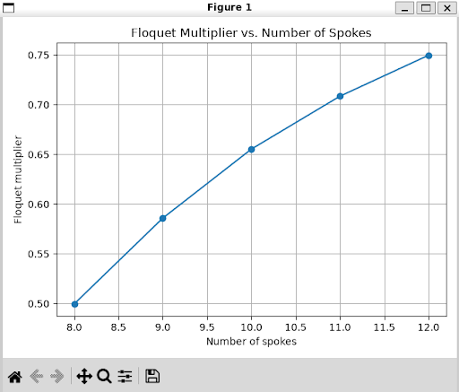

# Assignment 1: Rimless Wheel

## 1. Rimless Wheel Implementation

The rimless wheel was modeled as a hybrid dynamical system with continuous stance dynamics and discrete impact dynamics.

The state is

$$
x =
\begin{bmatrix}
\theta \\
\dot{\theta}
\end{bmatrix},
$$

where $\theta$ is the stance-leg angle measured from the upward vertical and $\dot{\theta}$ is its angular velocity.

The angle between adjacent spokes is $2\alpha$, where

$$
\alpha = \frac{\pi}{N}.
$$

During the continuous stance phase, the rimless wheel behaves like an inverted pendulum. Using the equations of motion, the continuous dynamics are

$$
\dot{\theta} = \dot{\theta}
$$

and

$$
\ddot{\theta}
=
\frac{g}{l}\sin\theta.
$$

The next spoke contacts the ground when

$$
\theta^- = \gamma+\alpha,
$$

where $\gamma$ is the downhill slope angle.

At impact, the stance spoke switches to the next spoke. This produces a coordinate shift of $2\alpha$:

$$
\theta^+
=
\theta^- - 2\alpha.
$$

Conservation of angular momentum about the new contact point gives the velocity reset

$$
\dot{\theta}^+
=
\dot{\theta}^-\cos(2\alpha).
$$

The continuous dynamics were integrated numerically using a fourth-order Runge-Kutta (RK4) method. The impact event was detected by monitoring the guard function

$$
h(\theta)
=
\theta-(\gamma+\alpha).
$$

When the guard crossed zero, the state was interpolated to estimate the impact state and the reset map was applied.

### Running the Code

From the repository root, the code can be run with:

```bash
uv run python assignment_1.py 
```

## 2. Sanity Checks
2.1 Impact and Reset Check

The first sanity check verifies that the impact condition and reset equations are implemented correctly.

The expected impact angle is

$$ \theta^-=\gamma+\alpha. $$

After impact, the coordinate should shift according to

$$ \theta^+ = \theta^- - 2\alpha. $$

The angular velocity should satisfy

$$ \dot{\theta}^+ = \dot{\theta}^-\cos(2\alpha). $$

For the chosen test state, the simulation produced

$$ \theta^- = 0.4799655 $$

and

$$ \theta^+ = -0.3054326. $$

The calculated post-impact angle exactly matched the expected value.

For a pre-impact angular velocity of $3.0$ rad/s, the simulation produced

$$ \dot{\theta}^+ = 2.1213203\text{ rad/s}, $$

which exactly matched

$$ 3\cos(2\alpha) = 2.1213203\text{ rad/s}. $$

Therefore, the impact coordinate shift and velocity reset were implemented correctly.

2.2 Energy Conservation Check

During the continuous stance phase, there is no energy dissipation, so total mechanical energy should remain approximately constant.

The total mechanical energy is

$$ E = \frac{1}{2}ml^2\dot{\theta}^2 + mgl\cos\theta. $$

The simulation gave an initial energy of

$$ E_0 = 10.4809633\text{ J} $$

and a final energy of

$$ E_f = 10.4809644\text{ J}. $$

The total energy change was

$$ \Delta E = 1.07\times10^{-6}\text{ J}. $$

This change is negligible compared with the total energy, indicating that the RK4 integration accurately conserves mechanical energy during the continuous stance phase.

<div align="center">
  
</div>

## 3. Region of Attraction

The region of attraction (RoA) was estimated by creating a grid of initial conditions in the $(\theta,\dot{\theta})$ state space. Each initial condition was simulated for multiple steps and classified according to whether the post-impact angular velocity converged to the stable rolling gait.

The resulting map shows the set of initial conditions that converge to the rolling limit cycle.

The region containing trajectories that converge to the rolling cycle represents its basin of attraction. Initial conditions outside this region do not successfully converge to the same rolling gait under the chosen parameters.

The slope affects the RoA because a steeper downhill slope provides more gravitational potential energy during each step. This makes it easier for the wheel to reach the next impact and sustain rolling.

<div align="center">
  
</div>

## 4. Poincaré Return Map

The impact event was used as a Poincaré section. Because the impact condition fixes the angle $\theta$, the Poincaré section is one-dimensional and can be represented by the post-impact angular velocity.

Let

$$ u_k=\dot{\theta}_k^+ $$

denote the angular velocity immediately after impact at step $k$.

The step-to-step return map is therefore

$$ u_{k+1}=P(u_k). $$

During the continuous stance phase, conservation of energy gives

$$ \frac{1}{2}ml^2(u_k^-)^2 + mgl\cos(\gamma+\alpha) = \frac{1}{2}ml^2u_k^2 + mgl\cos(\gamma-\alpha). $$

After simplifying,

$$ (u_k^-)^2 = u_k^2 + \frac{4g}{l}\sin\gamma\sin\alpha. $$

Applying the impact reset gives the analytical return map

$$ P(u) = \cos(2\alpha) \sqrt{ u^2+ \frac{4g}{l}\sin\gamma\sin\alpha }. $$

A fixed point of the return map satisfies

$$ P(u^*)=u^*. $$

For the default parameters, the theoretical fixed point was

$$ u^* = 1.1440\text{ rad/s}. $$

The return map was generated numerically by simulating one complete step for a range of initial post-impact angular velocities. The identity line

$$ u_{k+1}=u_k $$

was also plotted. Their intersection corresponds to the fixed point.

The stable limit cycle of the continuous hybrid system therefore appears as a stable fixed point in the one-dimensional Poincaré map.

<div align="center">
  
</div>

## 5. Floquet Multiplier

The local stability of the fixed point was evaluated using the slope of the Poincaré return map near the fixed point.

For a small perturbation $\delta$, the Floquet multiplier was estimated using a centered finite difference:

$$ \lambda_F \approx \frac{ P(u^*+\delta)-P(u^*-\delta) }{ 2\delta }. $$

For the default parameters, the numerical result was

$$ \lambda_F=0.49965. $$

The analytical return map gives

$$ \lambda_F = P'(u^*). $$

For this model, this simplifies to

$$ \lambda_F = \cos^2(2\alpha). $$

For $N=8$,

$$ \alpha = \frac{\pi}{8}, $$

so

$$ \lambda_F = \cos^2\left(\frac{\pi}{4}\right) = 0.5. $$

The difference between the numerical and analytical values was

$$ \left|0.49965-0.50000\right| = 3.50\times10^{-4}. $$

The close agreement validates the numerical return-map and impact implementation.

Because

$$ |\lambda_F|<1, $$

the rolling limit cycle is locally stable. A small perturbation from the fixed point decreases approximately by a factor of $\lambda_F$ after each step.

## 6. Effect of Slope

The slope angle $\gamma$ was varied to investigate its effect on the rolling behavior and local convergence.

Increasing the slope increases the amount of gravitational energy gained during the stance phase. From the analytical return map, the energy gained per step is related to

$$ \frac{4g}{l}\sin\gamma\sin\alpha. $$

Therefore, increasing $\gamma$ generally makes sustained rolling easier and increases the set of initial conditions that can converge to the rolling gait.

The ideal analytical Floquet multiplier is

$$ \lambda_F = \cos^2(2\alpha), $$

which does not directly depend on the slope angle $\gamma$. Therefore, the slope has a much stronger effect on the existence and region of attraction of the rolling gait than on its local convergence rate.

For sufficiently small slopes, some initial conditions may fail to reach the next impact because there is insufficient gravitational energy to sustain the forward rolling motion.

<div align="center">
  
</div>

## 7. Effect of Number of Spokes

The number of spokes was varied between 6 and 12 as required by the assignment.

Since

$$ \alpha = \frac{\pi}{N}, $$

the analytical Floquet multiplier becomes

$$ \lambda_F = \cos^2\left(\frac{2\pi}{N}\right). $$

Thus, increasing the number of spokes causes the Floquet multiplier to move closer to 1.

For example,

$$ N=6 \quad\Rightarrow\quad \lambda_F = 0.25, $$

while

$$ N=12 \quad\Rightarrow\quad \lambda_F = 0.75. $$

A smaller Floquet multiplier means stronger contraction of perturbations from one step to the next. Therefore, fewer spokes produce faster local convergence to the rolling limit cycle.

Conversely, increasing the number of spokes makes the wheel's geometry more closely spaced and causes the Floquet multiplier to approach 1, resulting in slower local convergence.

<div align="center">
  
</div>

## 8. Conclusion

The rimless wheel provides a simple example of a hybrid dynamical system in which continuous dynamics are combined with discrete impact events.

During the stance phase, the wheel follows inverted-pendulum dynamics. When the next spoke contacts the ground, the state undergoes an instantaneous reset due to the coordinate change and plastic collision.

Using the impact event as a Poincaré section reduces the periodic rolling motion to a one-dimensional return map. The rolling limit cycle becomes a fixed point of this map, and its local stability can be characterized using the Floquet multiplier.

The numerical implementation was validated through the impact/reset and energy-conservation sanity checks. The numerical Floquet multiplier for the default parameters was $0.49965$, in close agreement with the analytical value of $0.5$.

The parameter studies showed that increasing the slope generally makes sustained rolling possible from a larger region of the state space because more gravitational energy is available. In contrast, the local convergence rate is strongly affected by the number of spokes. Increasing the number of spokes causes the Floquet multiplier to approach 1, leading to slower local convergence.