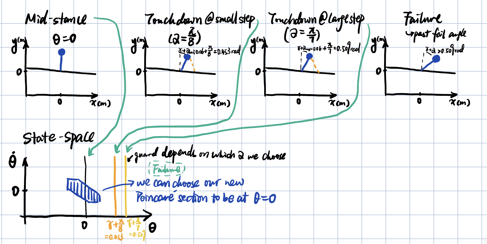

# Assignment 2: Inverted Pendulum Walker

## 1. Model and Sketches

This model is basically the rimless wheel again during stance, it's still just an
inverted pendulum falling down the slope, but now two things changed: the landing
angle $\alpha$ isn't fixed by the number of spokes anymore, it's something I get to
choose every step, and there's also a small ankle torque I can apply at the pivot.
Everything else carries over unchanged from assignment 1, including the touchdown
condition and the impact reset, where the angle shifts by $2\alpha$ and the velocity
scales by $\cos(2\alpha)$. Both controls are bounded: $\alpha$ has to stay between pi/8
and pi/7, and the torque can't go outside about -0.98 to +0.49 N*m for these
parameters.

The top row is the walker at the moments that seemed worth drawing: mid-stance with
the leg straight up at theta = 0, touchdown with the smallest allowed $\alpha$,
touchdown with the largest allowed $\alpha$, and a failure case where it has fallen
too far to recover. The bottom row puts those same snapshots on the state-space
plot and marks where the touchdown guard actually sits for each $\alpha$. That's
really the whole point of this sketch: the guard moves depending on which $\alpha$
you pick, so you can't use it as a fixed Poincare section anymore like we did for
the rimless wheel. That observation is what section 5 is about.

## 2. Sanity Checks

First I checked the impact and reset math with a made-up test state at the touchdown
angle and theta_dot = 3.0 rad/s going in. The simulation gave theta_plus = -0.3327
and theta_dot_plus = 2.1213 rad/s, which is exactly what the formulas predict, since
theta just shifts by $2\alpha$ and theta_dot gets scaled by $\cos(2\alpha)$. So the reset
is implemented correctly.

Second, with the ankle torque forced to zero, energy should be conserved during
stance since nothing is adding or removing it. Over one full stance phase the total
energy only changed by about 2e-13 J, which is just numerical noise from RK4, so
this confirms it is correct too.

## 3. Balance Controller

Close to the upright equilibrium I used feedback linearization: cancel out the
gravity term and add a PD term on top so the closed loop just becomes a standard
mass-spring-damper pointed at theta = 0. I picked the gains to be critically damped
with a natural frequency of about 4 rad/s, so kp = 16 and kd = 8. I did not tune
these carefully, I just wanted something that settles quickly without overshooting.

What is actually interesting is that the specific gain values barely matter here.
Because the torque is capped at such a small fraction of mgl, the controller does
not have enough torque left to cancel gravity once theta is too large, and this
happens before the PD term can do anything useful. Once sin(theta) times the
torque limit tells you it is out of reach, changing the gains does not change the
outcome. Saturation is what actually decides how big the region of attraction can
be, and I could predict pretty much exactly where the boundary would be, around
theta = 0.1 rad falling forward and -0.05 rad falling backward, with a one line
calculation before ever running the grid search in the next section.

## 4. Region of Attraction

To actually find the RoA I gridded up theta and theta_dot around the equilibrium
using 41 by 41 points and ran the closed-loop controller from every single grid
point for a few seconds, checking whether it settled near the origin or whether it
went past the point where a footstrike becomes unavoidable.

It comes out as a narrow diagonal strip, which makes sense once you think about the
saturation argument from section 3. States where kp * theta and kd * theta_dot are both
large and the same sign are the ones that saturate the torque and cannot be pulled
back, so the boundary ends up looking almost like a straight line. Any time the
walker's actual state lands inside this region, checked continuously and not just at
footstrikes, the ankle controller turns on and stays on, and the walker stands still.

## 5. Choosing the Poincare Section

For the rimless wheel, footstrike was a good Poincare section because the touchdown
angle only depended on fixed geometry. That does not work here since $\alpha$ is
something I am actively choosing every step, so the touchdown angle moves around and
the guard is not fixed anymore. You can see this directly in the sketch from section
1.

Mid-stance, at theta = 0, does not have that problem. No matter what $\alpha$ I pick,
the leg has to swing back through vertical at some point, so that crossing is always
at the same theta. It also matches the balance controller's own equilibrium, which
is convenient. So I used theta = 0 as the section, with theta_dot at that crossing as
the one state I track, and $\alpha$ gets chosen right at that same crossing for the
upcoming step.

## 6. Lookup Table and Grid Resolution

The table sweeps theta_dot_k from 0 up to sqrt(2g/l), the Froude number 2 bound,
against $\alpha$ over its allowed range. For each pair I simulate one ballistic step
with the torque off, starting at mid-stance, through touchdown, through the impact,
and forward again to the next mid-stance crossing, and that gives the next
theta_dot. A few combinations do not actually work. If the post-impact velocity is
too small the leg just swings back down instead of making it through vertical again,
and since there is no backward-impact guard in this model that trajectory has
nowhere left to go. At the resolution I ended up using, only 1 out of 40 states
had this problem.

Once I have the table, finding how many steps each state needs to reach standstill
is just backward induction. A state needs 0 more steps if it is already inside the
RoA, otherwise it needs one more step than whatever the best action leads to. Keep
repeating that until nothing changes and you get both the steps-to-go for every
state and the best action to take there, at the same time.

I wanted to actually check the grid resolution instead of just guessing, so I
rebuilt the whole table at a few different sizes and tracked what happens to a
fixed reference velocity around 2 rad/s:

| grid size | states with a valid action | steps, best policy | steps, longest still-safe path |
|-----------|------------------------------|----------------------|----------------------------------|
| 3         | 1 out of 3                   | never resolves        | never resolves                    |
| 5         | all of them                  | 2                    | 2                                 |
| 8         | all of them                  | 2                    | 3                                 |
| 10        | all of them                  | 2                    | 4                                 |
| 20        | all of them                  | 2                    | 4                                 |
| 40        | 39 out of 40                 | 2                    | 4                                 |
| 80        | 78 out of 80                 | 2                    | 4                                 |

3 points is obviously too coarse, it cannot even resolve the reference point. What
is more convincing is that 5 and 8 points both give the wrong answer for how many
steps this could take in the worst case, undercounting it as 2 and 3 when the real
answer, which the table agrees on from 10 points onward, is 4. So a coarser grid
does not just look a little noisier, it can actually give a confidently wrong
number. Once I reach 10 points the answer stops changing, so I used 40 for
everything below, well past the point where the numbers stop changing, and it
gives a smoother-looking plot. The small drop in valid states at 40 and 80 is not
a resolution problem, it is just finer sampling finding a couple of genuinely
stuck low-velocity states that the coarser grids happened to skip over.

## 7. Steps to Standstill

This is just the backward-induction result from the last section plotted out: for
each starting mid-stance velocity, how many footsteps the best policy needs before
the balance controller takes over. It comes out as a clean staircase, which makes
sense since states that are close together tend to need the same number of steps,
as they are all moving toward the same small RoA.

## 8. A Trajectory That Needs at Least 3 Steps

I scanned the table above for the smallest theta_dot_k that needs 3 steps under
the best policy, which turned out to be about 2.30 rad/s. Running the full
simulation from there, choosing $\alpha$ from the lookup table at each mid-stance
crossing and then switching over to the ankle controller once the state lands in
the RoA, gives:

You can see theta_dot losing a chunk of energy at each impact, and theta repeating
that sawtooth pattern until the last footstrike, after which the ankle controller
takes over and smoothly brings it to rest.

I also wanted to know how much longer the walker could keep going from this same
starting point if it was not following the best policy, so I searched the same
lookup table for the longest chain of $\alpha$ choices that still eventually
reaches the RoA, just not necessarily in the fewest steps. That came out to 4
steps, one more than the 3 the best policy takes, so this starting velocity has
one extra step of room before it is forced to stop.

## 9. Conclusion

The main conceptual change from the rimless wheel was that once $\alpha$ becomes a
control input instead of a fixed geometric constant, the footstrike guard moves
around with it and can no longer be used as a Poincare section, so mid-stance
turned out to be the natural fixed point to use instead. Past that, the two
controllers do fairly different jobs. The lookup-table policy reduces speed one
step at a time, using how much energy is lost at each impact, while the ankle
controller only has to deal with whatever small amount of motion is left once the
walker's state lands inside its fairly small, saturation-limited region of
attraction. The backward induction on the lookup table was useful because it
gives both the steps-to-go map and the actual policy at the same time, and reusing
the same table to search for the worst-case number of steps was a simple way to
see how much room a given starting condition has before it must stop and stand
still.
